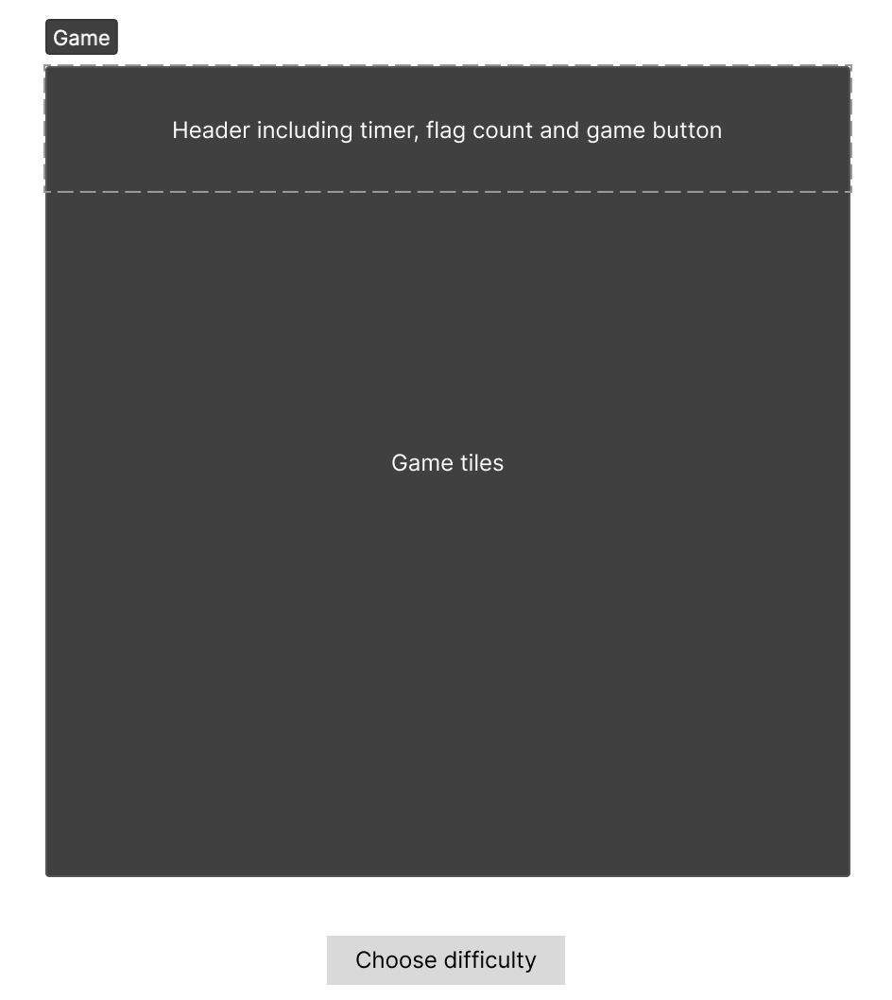

# Minesweeper
## Overview
A quick explanation of how Minesweeper works: 
You have a certain number of tiles where they are all covered in the beginning. Your task is to uncover those tiles one by one without stepping on - or uncovering - a mine tile. 
The numbered tiles tell you the number of adjacent mines are there.

[Quick explainer video](https://www.youtube.com/watch?v=dvvrOeITzG8)

## List of technologies
- HTML
- CSS
- Javascript
- Text editor
- Lots of headache

## Wireframes and user story

As a user, you can start playing, or choose your difficulty level to start uncovering the tiles.

## Programming process
First, I started by styling a general layout of the title of the game and making space for a grid where the tiles will go.
Next, I populated the grid with tiles to fit nicely, then wrote a couple of functions, one of which would place a predefined
number of mines randomly on the grid. Then, the second function would go through the grid and look at the neighbouring cells
and determine what number should the tile hold. If you clear all the tiles that don't have mines, you win. But, if you trip 
on a mine then you lose! Et voilà, we have a game. \
Now I had to make the game look nice. So, I grabbed the tiles and pictures from [minesweeper.online](https://minesweeper.online).\
Finally, I added some nice features, such as a flag counter and a timer on top of the grid as a header.

## Unsolved problems
~I would like to add a chording feature - chording happens when you have all flags surrounding a number marked and you click the number which then
reveals all non-mine tiles around that number.~\
Also adding a proper boarder would make the game look much better.\
There are minor bugs that need fixing but nothing major or game breaking.

## Game end (Win or Lose)
As I mentioned before in the programming process, you win the game when you uncover all non-mine tiles, and you lose if you uncover a tile that has a mine
underneath it.

## Favourite function
I have to say my favourite function is the flood fill function. In the programming process I was planning on iterating through the tiles to check
if they had a mine, so that when you uncover a tile with 0 adjacent mines, it should uncover all the surrounding tiles until it reaches
tiles with mines underneath. \
It turns out that iterating through the board is inefficient, and could cause problems with bigger boards.

Enter, flood fill algorithm (implemented using Breadth First Search), which is a recursive function that does the job efficiently.

You can read more about the algorithm on [Wikipedia](https://en.wikipedia.org/wiki/Flood_fill)
